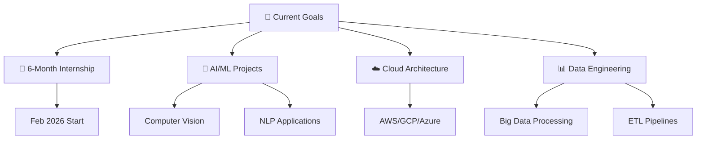

# 🚀 Hi there, I'm ACHRAF EL HOUFI!

---

## 🎯 About Me

### 👨‍💻 **Achraf El Houfi** | Future Software Engineer

<table align="center">
<tr>
<td align="center" width="50%">

### 🚀 **WHO AM I?**

🎓 **5th Year Software Engineering Student**  
🏫 **EMSI - Marrakech, Morocco** 🇲🇦  
🎯 **Specialization**: MIAGE  
📚 **Focus**: Computer Science & Networks

🔍 **Looking for 6-month internship**  
📅 **Starting**: February 2026

</td>
<td align="center" width="50%">

### 💡 **WHAT I DO?**

🌐 **Building scalable web applications**  
🤖 **Exploring AI/ML technologies**  
📊 **Data engineering solutions**  
☁️ **DevOps & Cloud computing**

💼 **3+ years development experience**  
🌍 **Languages**: Arabic, French, English

</td>
</tr>
</table>

### 🎯 **2026 GOALS**

🎓 **Complete Software Engineering degree** | 🏗️ **Master cloud architecture patterns** | 🌟 **Contribute to open-source projects** | 🚀 **Build impactful SaaS solutions**

---

### **BEYOND CODE**

**Gaming Enthusiast** • ♂️ **Sports Lover** • 🔍 **Tech Explorer** • 🌍 **Marrakech Based**

---

## 🏆 Professional Experience

<b>🔥 Full-Stack Developer Intern @ Le Gestionnaire (July-August 2025)</b>

### 📋 AtlasDocs SaaS Platform

> _Commercial document management and collaboration platform_

**🎯 Key Achievements:**

- 🚀 Improved document management efficiency by **85%** through automation
- 🔐 Implemented JWT authentication & email integration
- 📊 Built comprehensive data visualization dashboard
- ☁️ Integrated Google Cloud Storage for scalable file management

**🛠️ Tech Stack:** `Django` `REST Framework` `PostgreSQL` `Docker` `React` `Google Cloud` `Git`

<b>⚡ Back-End Developer Intern @ Vigon Systems (July 2024)</b>

### 🎫 VGT Internal Ticket Management

> _Internal IT ticket management solution_

**🎯 Key Achievements:**

- 📈 Optimized ticket tracking efficiency by **70%**
- 💬 Integrated real-time chat functionality
- 📄 Automated PDF report generation
- 🏗️ Designed robust MVC/MVT architecture

**🛠️ Tech Stack:** `Django` `Tailwind CSS` `MySQL` `Git` `Jira`

<b>📊 IT Developer Intern @ Allianz Imasnaoune (July 2022)</b>

### 📈 Insurance Analytics Dashboard

> _Dynamic insurance contract data visualization_

**🎯 Key Achievements:**

- 📊 Created interactive data visualization dashboard
- 🔍 Implemented advanced data analysis workflows
- 📱 Built responsive web application interface

**🛠️ Tech Stack:** `Python` `Pandas` `NumPy` `MySQL` `Dash` `Tailwind CSS`

---

## 🚀 Featured Projects

### 📋 **AtlasDocs SaaS Platform** - _Commercial Document Management_

> **Le Gestionnaire Internship (July-August 2025)**

**🎯 Project Overview:**

- 📊 Commercial document management and collaboration platform
- 🔐 JWT authentication with email integration for sharing links and notifications
- � 85% improvement in document management efficiency through automation
- ☁️ Google Cloud Storage integration for scalable file management

**🛠️ Tech Stack:** `Django` `REST Framework` `PostgreSQL` `Docker` `React` `Google Cloud Storage` `Git`

---

### 🎫 **VGT Ticket Management System** - _Internal IT Solution_

> **Vigon Systems Internship (July 2024)**

**🎯 Project Overview:**

- 🏗️ Internal solution for IT ticket management with MVC/MVT architecture
- � Real-time chat integration for improved communication
- � Automated PDF report generation
- 📈 70% optimization in ticket tracking efficiency

**🛠️ Tech Stack:** `Django` `Tailwind CSS` `MySQL` `Git` `Jira`

---

### 📊 **Insurance Analytics Dashboard** - _Data Visualization Platform_

> **Allianz Imasnaoune Internship (July 2022)**

**🎯 Project Overview:**

- 📈 Dynamic insurance contract data visualization
- � Interactive dashboard with advanced data analysis workflows
- � Responsive web application for data insights
- � Comprehensive analytics for insurance contract management

**🛠️ Tech Stack:** `Python` `Pandas` `NumPy` `MySQL` `Dash` `Tailwind CSS`

---

### 🏥 **Pharmacy Locator Web App** - _Academic Project_

> **EMSI Academic Project**

**🎯 Project Overview:**

- 🗺️ Web application for locating pharmacies across Morocco
- 📊 Dynamic charts integration for decision-making support
- 🏢 Data collection from 3 internal departments
- 📈 Enhanced decision-making capabilities for agency managers

**🛠️ Tech Stack:** `Spring Boot` `Angular`

---

### 👤 **Employee Facial Recognition System** - _AI-Powered Management_

> **EMSI Academic Project**

**🎯 Project Overview:**

- 🤖 Employee management system with facial recognition
- � Integrated chat and video call system
- � 60% improvement in communication reactivity
- 🏥 Enhanced patient-doctor communication features

**🛠️ Tech Stack:** `Python` `OpenCV` `TensorFlow`

---

## 💻 Tech Arsenal

### 🔥 Programming Languages

### ⚡ Frameworks & Libraries

### 🗄️ Databases & Cloud

### 🛠️ DevOps & Tools

### 🎨 Frontend Technologies

---

## 📊 GitHub Analytics

  

  

  

---

## 🏆 Achievements & Certifications

### 📜 Coursera Certifications

- 🏗️ **Software Design and Project Management**
- ☁️ **Virtual Networks in Azure**
- 🐳 **Introduction to Containers w/ Docker, Kubernetes & OpenShift**
- ⚡ **AWS Cloud Technical Essentials**
- 🐧 **The Unix Workbench**
- ☁️ **Introduction to Cloud Computing**
- 🤖 **Introduction to Machine Learning with Python**

### 🎓 Education

**École Marocaine des Sciences de l'Ingénieur (EMSI - Marrakech)**

- 🎯 **Engineering Cycle:** Computer Science & Networks (2023 - Present)
- 📚 **Preparatory Cycle:** Mathematics & Physics (2021 - 2023)
- 🌟 **Specialization:** MIAGE (Methods and Computer Tools Applied to Management)

---

## 🌟 Current Focus

---

## 🎮 Fun Facts

- 🎯 I speak **3 languages**: Arabic (native), French (fluent), English (intermediate)
- 🎮 Gaming enthusiast & sports lover
- 🌍 Based in beautiful **Marrakech, Morocco**
- 🔍 Always exploring new technologies and frameworks
- 📱 Mobile: **+212 611-945026**
- ⚡ Fun fact: I love combining AI with real-world applications!

---

## 📈 2024-2026 Roadmap

| Year     | Goals                                                                               | Status          |
| -------- | ----------------------------------------------------------------------------------- | --------------- |
| **2024** | ✅ Complete internships ✅ Build portfolio projects ✅ Learn Docker & Cloud | **Completed**   |
| **2025** | 🔄 Advanced AI/ML projects 🔄 Contribute to open source 🔄 Master DevOps    | **In Progress** |
| **2026** | 🎯 Graduate as Software Engineer 🎯 Land dream job 🎯 Launch SaaS product   | **Planned**     |

---

## 🤝 Let's Connect!

### 💬 Open for collaboration on:

- 🚀 **Full-Stack Web Applications**
- 🤖 **AI/ML Projects**
- 📊 **Data Engineering Solutions**
- ☁️ **Cloud-Native Applications**

### 📫 Reach out to me:

---

### ⭐ Thanks for visiting my profile!

**If you like my work, consider giving it a ⭐!**

---

_"Code is like humor. When you have to explain it, it's bad." - Cory House_

